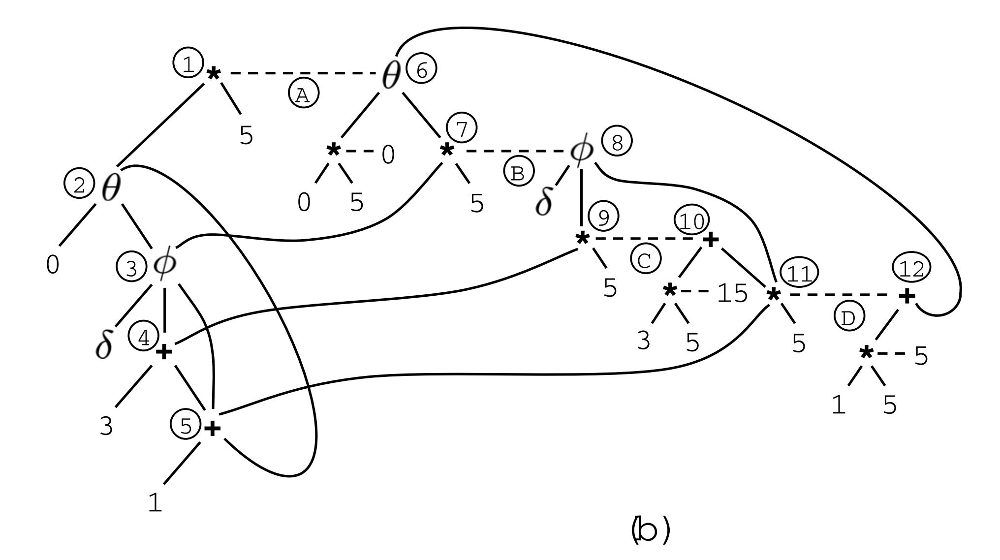
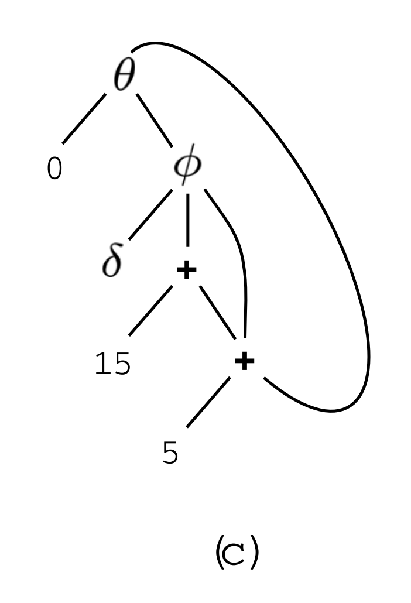

# Overview:
This paper presents a solution to the classic optimization ordering problem found in traditional compilers by using e-graphs and equality saturation. They represent programs as Program Expression Graphs (PEGs) and use optimizations encoded as equalities to saturate E-PEGs, or e-graphs where the nodes are PEGs. Equalities in the resulting E-PEG relate computationally equivalent versions of the input programs. The final, optimized program is selected from the E-PEG using what the authors term a “global profitability heuristic.”

The authors highlight two advantages of this approach of doing optimizations in compilers. First, it bypasses the phase ordering problem by exploring an exponentially large space of equivalent programs, each of which represent the result of applying different permutations of optimizations to the unoptimized program, and selecting the optimal program out of the resulting space. Second, traditional compiler heuristics are local, and only determine whether to apply a given optimization at a given location, without much regard towards what other optimizations might be applied in the future. Using e-graphs to solve this problem also had the fortunate effect of being able to arrive at relatively complicated optimizations such as loop strength reduction from a set of axioms encoding relatively simple optimizations.

# Example
To illustrate the core concepts, the paper uses an elegant running example:
```C
1: i := 0
2: while (...) {
3: 	use(i * 5);
4: 	i := i + 1;
5: 	if (...) {
6: 		i := i + 3;
7: 	}
8: }
```
This program can be optimized using "loop-induction-variable strength reduction," producing the following code:
```C
1: i := 0
2: while (...) {
3: 	use(i);
4:	i := i + 5;
5:	if (...) {
6:		i := i + 15;
7:	}
8: }
```
## Formulating a Program Expression Graph (PEG)

To automatically perform this optimization using equality saturation, the authors propose a representation for computations called Program Expression Graphs (PEGs), which represent operators (plus, minus, multiplication, etc.) as nodes and arguments as edges. The original program (top) can be represented as the following PEGs.


In the PEG above, node 1 (with two outgoing edges pointing to `theta` and `5`) represents `i*5` in the original program. `theta` (node 2) represents the value of `i` throughout the execution, with its left child `0` being the initial value and the right child `phi` representing the value of `theta` in each iteration of the `while` loop. 

Node 3, 4 & 5 encode line 4-7 in the original program. Let’s start with node 3, with a `theta` operator. `theta` takes three arguments and behaves as a selector: the first argument `delta` encodes the branch condition (`...` on line 5), the second argument node 4 encodes the case when the branch condition evaluates to true (`i := i + 3` on line 6 and `i := i + 1` on line 4 are executed), and the third argument node 5 encodes the case when the branch condition evaluates to false (only `i := i + 1` on line 4 is executed). 

It’s worth noting that the right child of node 5 is actually node 2 (`theta`) because when computing `i + 1` on line 4, the i comes from the previous iteration, whose value is stored in node 2.

## From PEG to E-PEG

Once the PEG is formulated for the original program, a saturation engine then tries to generate an E-PEG, which is PEG with equivalence classes (denoted by dash lines), and it does so by applying axioms to the original PEG. There are three sample axioms described in the paper:

(a+b)*m = a*m + b*m
theta(a,b)*m = theta(a*m, b*m)
phi(a,b,c) * m = phi(a, b*m, c*m)

Note that theta and phi are the special operator nodes described previously.

The saturation engine selects “triggers,” i.e., expression patterns where these axioms could be applied. When a trigger matches certain parts of a PEG, the saturation engine invokes a callback function, which adds a new expression to the PEG based on the axioms applied, and draws equivalence edges between the original expression and the new expression, effectively forming an E-PEG!

The graph below shows the E-PEG after applying the three axioms stated above.


Edge A comes from applying axiom 2, edge B from axiom 3, and edge C&D from axiom 1. It’s useful to work out these edges in your head.

This E-PEG now represents *multiple* optimized versions of the input program. What we need to do next is to pick the “best” version.

## Finding the best version

Choosing the best version from the space of possible optimized programs is the job of a global profitability heuristic (more on this in a later section). In short, the heuristic can pick a subset of nodes from the E-PEG that it thinks is the best. In this example, the heuristic can pick node 6, 8, 10, and 12, resulting in the figure below.


And this new PEG represents the optimized program at the beginning of this section, and the technique involved happens to be "loop-induction-variable strength reduction"! Pretty cool.
# Saturation Engine
In order to encode equalities, the authors implemented a saturation engine to carry out the equality saturation of the E-PEG. They mentioned initially implementing a naive approach in which all axioms were repeatedly checked each time a new equality was added, but finding that this approach was too slow to be tenable. Instead, they turned to an algorithm well known in the AI community known as the Rete algorithm to find instances of triggers for their equality rules in the E-PEG and repeatedly fire the callback functions which added more equalities to the E-PEG. They briefly mentioned using some more restrictive triggers for some rules to prevent an explosion of state in the E-PEG, but did not provide discussion of how they chose triggers beyond this. In addition, they implemented a breadth-first variant of the Rete algorithm to prevent the engine from exploring a single infinitely deep branch of the program space.
# Global Profitability Heuristic
Because of the self-referential nature of many of the PEG nodes, a simple minimax algorithm was unavailable in this context to select the optimal program from the saturated E-PEG. Instead, they used a Pseudo-Boolean encoding and solver to solve this problem. Initially, they assigned a constant cost $C_n = basic\_cost(n) * k^{depth(n)}$ to each node, where $basic\_cost(n)$ encoded the inherent cost of that node, $depth(n)$ denoted the loop depth of the node, and $k$ was chosen to be 20 by the authors. Then, they assigned a Pseudo-Boolean variable (a variable with value either 1 or 0) $B_n$ to each node, where a value of 1 meant that the node was chosen to be part of the candidate program. Finally, they initialized a Pseudo-Boolean solver with some constraints which roughly denoted the fact that a well-form program should be chosen, and used it to minimize $\sum_n B_n * C_n$ to find the optimal program in the space of programs represented by the E-PEG. In their performance evaluation, they mentioned that this section took the longest, with on average ~1.5s per method that they compiled and tested. For more details on the global profitability heuristic, check out section 8.3 in the full paper.
Skip:
Sections 4, 5, 6.1

# Suggested Reading Order:
We suggest the following reading order for the paper:
(optional) Watch the authors’ [POPL presentation](https://www.youtube.com/watch?v=hL2MARuBCzw) for a high-level overview of the paper and system
Read Sections 1, 2, and 7 to get a sense of the goals of the paper, and the results they got
Read Subsections 6.2 and 6.3 to dive into the details of their system
Read Section 3 for a worked example of arriving at inter-loop strength reduction using Peggy.
We recommend skipping Sections 4, 5, and 6.1 unless you are interested in how they formalized their approach and the Java-specific obstacles they overcame to implement Peggy.
The full paper’s layout is almost identical to that of the conference paper, so if you are curious about getting more details, you can also read that. 
# Further Reading:
[Full paper](https://arxiv.org/pdf/1012.1802.pdf)

[POPL presentation](https://www.youtube.com/watch?v=hL2MARuBCzw)
# Discussion Questions:
The authors do not seem to discuss how triggers are selected, and the performance of equality saturation could depend on the selection of triggers. This seems to relate to a well-known problem in Binary Decision Diagrams (BDDs) of selecting a proper variable order, where the selection of variable order also determines the compression power of a BDD. Given that both PEGs and BDDs seem to promote reuse of subgraphs, are these two problems related in a fundamental way?
Are there certain domains where using equality saturation is NOT such a good idea? In other words, what are the tradeoffs?
How would you design a saturation engine based on Datalog?
What is the expressiveness of PEGs? What type of programs cannot be encoded in this formalism?
Could this approach be reworked to another domain where the performance of program extraction could be improved?
